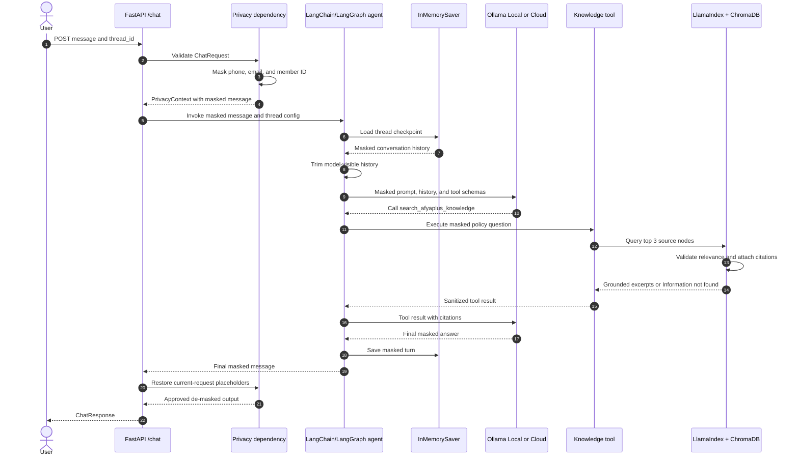
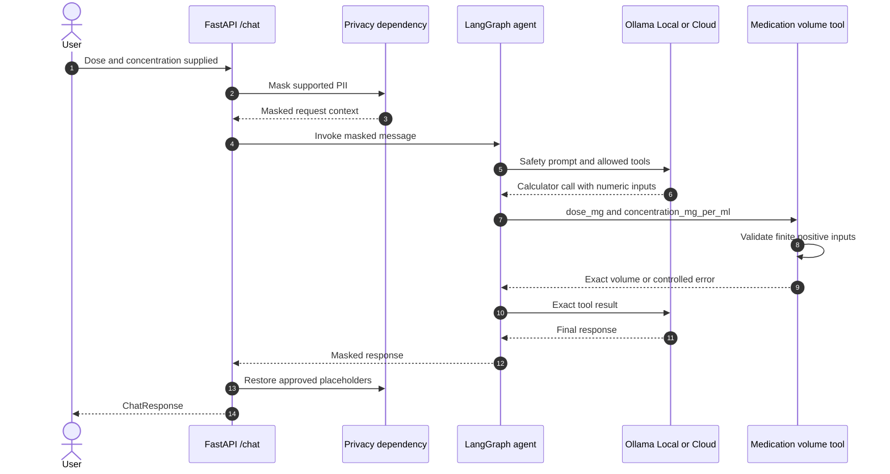
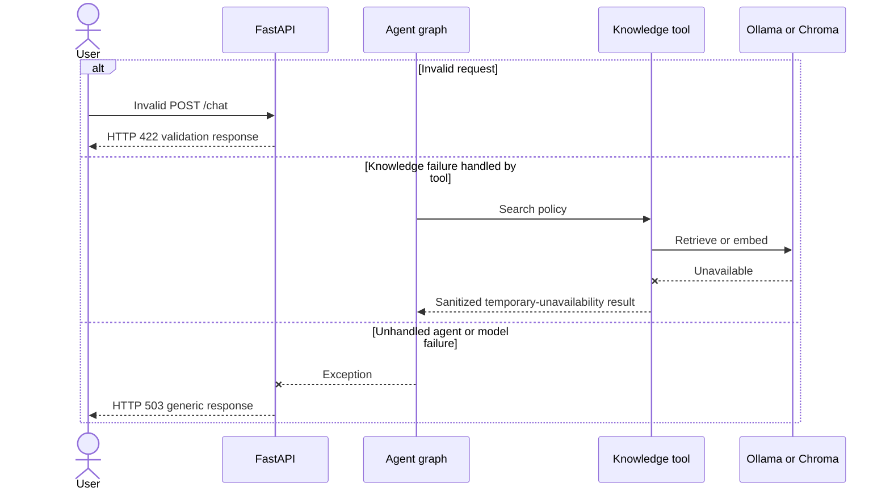

# AfyaPlus Enterprise-Grade RAG-Powered Agent System

> Historical decision record: the embedding and Chroma deployment approach in
> this document was superseded by issue #32. The current application uses
> Qdrant Cloud Inference for embedding, vector storage, and retrieval. Use
> `README.md`, `.env.example`, and `docs/architecture.md` for current setup.

## Ollama and Ollama Cloud Deployment Strategy

**Document status:** Implemented — see "Implementation status" below  
**Last verified:** 17 July 2026  
**Scope:** AfyaPlus only  
**Out of scope:** OpenRouter configuration belonging to the separate CI application(triage engine)

### Implementation status

Sections 9–12's design has shipped in the working tree (tracking issue
[#26](https://github.com/pmutua/AfyaPlus-Triage-Engine/issues/26), not yet
committed):

| Requirement | Implementation |
|---|---|
| Provider factory (§11) | `app/config.py` — `load_settings()` + `build_chat_model()` |
| Embedding independence (§10) | `app/rag/embeddings.py` — `EMBEDDING_PROVIDER`/`OLLAMA_EMBEDDING_BASE_URL` |
| Recommended env vars (§9.2) | `.env.example` / `.env` |
| Connectivity verification (§12) | `scripts/verify_provider.py` |
| Testing requirements (§16) | `tests/test_config.py`, `tests/test_embeddings.py` (14 tests) |

The rest of this document remains accurate design guidance; inline notes
below point from each relevant section to its shipped counterpart.

---

## 1. Executive Summary

AfyaPlus is an enterprise-grade, retrieval-augmented AI agent designed around privacy masking, grounded responses, tool safety, traceable citations, and flexible model deployment.

The system supports two model execution pathways:

1. **Local Ollama** for private, offline, low-cost development and controlled deployments.
2. **Ollama Cloud** for access to larger hosted models without purchasing or operating GPU infrastructure.

The application must be able to switch between these pathways through environment configuration only. The following components must remain unchanged regardless of the selected model pathway:

- FastAPI request and response contracts
- Privacy masking and de-masking
- LangGraph state and orchestration
- Conversation memory
- LlamaIndex retrieval
- ChromaDB persistence
- Citation validation
- Calculator safety boundaries
- Knowledge-tool contracts

OpenRouter is not part of this AfyaPlus implementation. Any OpenRouter variables found in a shared `.env` file belong to a separate CI application and must not be integrated into AfyaPlus.

---

## 2. Why Ollama Is a Strong Fit for AfyaPlus

### 2.1 Local-first privacy

Local Ollama allows inference to run on hardware controlled by the developer or organization.

This supports the AfyaPlus privacy model because:

- raw identifiers can remain inside the FastAPI request boundary
- the privacy vault does not enter the model layer
- private source documents can remain local
- embeddings can be generated without sending document chunks to an external provider
- the system can continue working without internet access when local models are used

Local inference does not remove the need for masking, authorization, auditing, or secure storage. It provides an additional layer of control by reducing external data transfer.

### 2.2 Simple development experience

A developer can install Ollama, pull a model, and expose a local API without setting up a GPU cluster or a separate inference server.

```bash
ollama serve
ollama pull llama3.2
ollama run llama3.2
```

The native local API is available at:

```text
http://localhost:11434/api
```

Ollama also provides OpenAI-compatible endpoints under:

```text
http://localhost:11434/v1
```

This makes it practical to integrate with LangChain, LlamaIndex, OpenAI-compatible clients, FastAPI services, and custom agent loops.

### 2.3 Tool calling

Ollama supports tool calling, allowing a model to request execution of controlled functions and consume their results.

This aligns with the AfyaPlus design:

- the model may request `search_afyaplus_knowledge`
- the model may request the medication-volume calculator
- tools execute in application code, not inside the model
- results are returned to the agent for the next reasoning step

Tool calling does not give the model unrestricted access to the operating system or database. The application decides which tools exist, validates their arguments, and controls their outputs.

### 2.4 Provider portability

The agent architecture should depend on a provider factory rather than directly constructing a hard-coded model client.

This permits:

```text
Development     -> Local Ollama
Demonstration   -> Ollama Cloud Free
Regular usage   -> Ollama Cloud Pro
Heavy usage     -> Ollama Cloud Max or controlled self-hosting
```

The model transport changes, but the RAG, privacy, memory, tool, and API layers remain stable.

---

## 3. Why Ollama Cloud Is Useful

Ollama Cloud hosts supported models on remote compute. Cloud models allow developers to use models that would not fit in the memory or GPU capacity of a typical laptop.

According to the Ollama documentation, cloud models are automatically offloaded to Ollama's cloud service while remaining available through Ollama tooling.

This means a developer can use:

```bash
ollama run gpt-oss:120b-cloud
```

without downloading and running the full model weights locally. Cloud
model tags append a `-cloud` suffix to the size tag (verified against
`docs.ollama.com/cloud`) — not a bare `:cloud` suffix; the direct Ollama
Cloud API (§8.3) instead uses the model name *without* that suffix (e.g.
`gpt-oss:120b`).

### Benefits

- no local enterprise GPU is required
- large models can be evaluated from ordinary development machines
- the same Ollama ecosystem can be used locally and remotely
- the application can retain its existing tool-calling architecture
- infrastructure management is reduced
- developers can start with a free cloud allowance and upgrade only when necessary

### Important boundary

Using Ollama Cloud means model-visible content leaves the organization's infrastructure.

For AfyaPlus, only the following may be sent to Ollama Cloud:

- privacy-masked user messages
- masked conversation history
- approved system instructions
- tool schemas
- sanitized tool results
- approved grounded excerpts

The following must never be transmitted:

- the privacy vault
- raw phone numbers
- raw email addresses
- raw member identifiers
- credentials
- API keys
- unapproved patient or member records

---

## 4. Ollama Cloud Plans

> Pricing and quotas can change. Verify the official pricing page before making production commitments.

### 4.1 Free

The current Free plan is listed at **$0** and includes:

- the ability to run models on local hardware
- access to cloud models
- CLI, API, and desktop application access
- unlimited public models
- community integrations
- privacy-focused local execution
- a limited cloud usage allowance

The Free plan is best suited to:

- learning
- coursework
- prototypes
- demonstrations
- light RAG testing
- evaluating cloud models
- occasional agent runs

The Free plan should not be treated as an unlimited production service. Cloud usage is constrained, and capacity may be insufficient for continuous or high-volume customer traffic.

### 4.2 Pro

The current Pro plan is listed at:

```text
$20 per month
or $200 per year when billed annually
```

It includes everything in Free, plus:

- access to larger and more powerful cloud models
- up to three cloud models running at a time
- 50 times more cloud usage than Free
- private model upload and sharing

Pro is appropriate for:

- regular engineering work
- repeated RAG evaluation
- daily coding or agent workflows
- larger document-analysis tasks
- development teams that need more cloud capacity
- staging or controlled pilot deployments

### 4.3 Max

The current Max plan is listed at:

```text
$100 per month
```

It includes everything in Pro, plus:

- up to ten cloud models running at a time
- five times more usage than Pro

Max is intended for more demanding workflows, including:

- multiple simultaneous agents
- sustained experimentation
- heavy coding automation
- larger team workloads
- high-frequency evaluation
- more demanding pre-production environments

A paid consumer plan should still be evaluated carefully before it is used for regulated or business-critical production workloads. Capacity, support, privacy terms, regional requirements, retention terms, and service assurances must be reviewed separately.

### 4.4 Team (coming soon)

Confirmed live on `ollama.com/pricing` during this audit: a **Team** plan is
listed as "coming soon," adding shared team usage allocation, centralized
billing/administration, single sign-on, and model access controls. Not
directly relevant to AfyaPlus's current single-developer capstone scope,
but worth tracking if this moves toward a multi-developer deployment.

---

## 5. Why the Cloud Free Tier Exists

Cloud inference uses expensive compute, so the Free plan is not the same as unlimited GPU hosting.

The Free tier exists primarily to lower the barrier to adoption. It allows developers to:

- experience Ollama Cloud before paying
- evaluate large models that cannot run locally
- build integrations against the cloud API
- test agents, RAG pipelines, and coding tools
- validate whether paid capacity is justified

The commercial model is similar to many developer platforms:

```text
Free usage
    -> experimentation and adoption
    -> regular usage
    -> Pro upgrade
    -> heavy usage
    -> Max or enterprise infrastructure
```

Paid plans subsidize platform development and provide greater cloud capacity to users who need sustained workloads.

For AfyaPlus, the Free tier is an evaluation and demonstration pathway, not a guaranteed long-term production capacity plan.

---

## 6. Local Ollama Versus Ollama Cloud

| Area | Local Ollama | Ollama Cloud |
|---|---|---|
| Model execution | Developer or organization hardware | Ollama-hosted infrastructure |
| Internet required | No, after models are downloaded | Yes |
| Local GPU required | Depends on model size | No |
| Data control | Highest infrastructure control | Masked content is transmitted externally |
| Setup | Install Ollama and pull models | Sign in or use an API key |
| Cost | No per-request fee; hardware/electricity still apply | Free allowance, then paid plans |
| Scale | Limited by local machine | Depends on cloud plan and service capacity |
| Large models | Often impractical locally | Main use case |
| Best use | Development, private testing, offline work | Larger models, demos, regular hosted inference |
| Embeddings | Recommended locally for AfyaPlus | Not the default AfyaPlus approach |

---

## 7. AfyaPlus Request Architecture

### 7.1 Grounded chat request



The privacy vault must never enter:

- the agent
- the model
- memory
- the knowledge tool
- the vector store

Only the approved final API response may cross back through the vault.

### 7.2 Calculator tool request



The calculator must only perform arithmetic. It must not:

- choose a dose
- validate a prescription
- diagnose a condition
- decide whether treatment is appropriate
- replace clinical judgment

### 7.3 Failure paths



Internal exceptions, API keys, stack traces, and authorization headers must not be returned to users.

---

## 8. Authentication: `ollama signin` Versus API Keys

### 8.1 What `ollama signin` does

Running:

```bash
ollama signin
```

links the local Ollama CLI/runtime to an Ollama account.

It allows the local installation to access authenticated Ollama functionality, including supported cloud-model workflows.

It does not:

- upload all local models
- deploy the developer's computer
- publish local documents
- automatically configure a remote FastAPI deployment
- expose a reusable production API key to Cloudflare or another host

### 8.2 Local cloud-model proxy pathway

When the local Ollama installation is signed in, the application may call the local endpoint while Ollama offloads a supported cloud model remotely.

```text
FastAPI
    -> http://localhost:11434
    -> signed-in local Ollama runtime
    -> Ollama Cloud
```

Example concept (using AfyaPlus's actual `app/config.py` variable names,
per §9.2 — not Triage Engine's unprefixed `OLLAMA_*` vars from §9.1):

```env
OLLAMA_LOCAL_BASE_URL=http://localhost:11434/v1
OLLAMA_LOCAL_MODEL=gpt-oss:120b-cloud
OLLAMA_LOCAL_API_KEY=ollama
```

This pathway requires Ollama to be installed, running, and authenticated on the host executing FastAPI.

### 8.3 Direct Ollama Cloud pathway

A deployed application can connect directly to Ollama Cloud.

```text
FastAPI
    -> HTTPS
    -> https://ollama.com
    -> Authorization: Bearer <API_KEY>
    -> Ollama Cloud model
```

This requires a real Ollama API key. The placeholder value `ollama` is not a valid cloud credential.

The native Ollama cloud API uses:

```text
https://ollama.com/api
```

An OpenAI-compatible client may use the compatible `/v1` interface where supported by the selected integration.

Never print, log, commit, or return the API key.

---

## 9. Recommended Environment Configuration

### 9.1 Triage Engine's configuration (unrelated, do not reuse)

Unprefixed `OLLAMA_*` names like these belong to `triage/engine.py`'s local
fallback, a separate capability in the same repo — not to AfyaPlus's
`app/config.py`:

```env
OLLAMA_BASE_URL=http://localhost:11434/v1
OLLAMA_MODEL=llama3.2
OLLAMA_API_KEY=ollama
LOCAL_TIMEOUT_SECONDS=20.0
```

`LOCAL_TIMEOUT_SECONDS` is the one name AfyaPlus's local settings
(§9.2) also read — both components happen to use the same default (20s)
independently.

### 9.2 Implemented provider configuration

Shipped as-is in `.env.example`/`.env` and read by `app/config.py`:

```env
# Valid values: ollama_local | ollama_cloud
MODEL_PROVIDER=ollama_local

# Local Ollama chat
OLLAMA_LOCAL_BASE_URL=http://localhost:11434/v1
OLLAMA_LOCAL_MODEL=llama3.2
OLLAMA_LOCAL_API_KEY=ollama

# Ollama Cloud chat
OLLAMA_CLOUD_BASE_URL=https://ollama.com/v1
OLLAMA_CLOUD_MODEL=<supported-cloud-model>
OLLAMA_CLOUD_API_KEY=<secret>

# Timeouts
LOCAL_TIMEOUT_SECONDS=20.0
CLOUD_TIMEOUT_SECONDS=30.0

# Conversation history
AGENT_HISTORY_TOKEN_BUDGET=2048

# RAG embeddings remain local by default
EMBEDDING_PROVIDER=ollama_local
OLLAMA_EMBEDDING_BASE_URL=http://localhost:11434
OLLAMA_EMBEDDING_MODEL=embeddinggemma

# Persistent ChromaDB
CHROMA_STORAGE_DIR=storage/chroma
CHROMA_COLLECTION_NAME=afyaplus_knowledge_base
```

### 9.3 OpenRouter exclusion

Any variables such as these are unrelated to AfyaPlus:

```env
OPENROUTER_API_KEY=...
MODEL_BASE_URL=https://openrouter.ai/api/v1
CLOUD_MODEL=...
```

They belong to a different CI application.

AfyaPlus implementation code must:

- not select OpenRouter
- not depend on OpenRouter
- not delete shared OpenRouter variables
- not rename them as part of this task
- not include OpenRouter in AfyaPlus provider tests
- not send AfyaPlus prompts to OpenRouter

---

## 10. Keep Chat and Embeddings Independent

The chat model and embedding model have different responsibilities and must not share a single base URL implicitly.

### Chat model

Used for:

- agent reasoning
- deciding whether to call tools
- producing final answers
- interpreting grounded tool results

### Embedding model

Used for:

- document indexing
- user-query vectorization
- semantic retrieval
- ChromaDB similarity search

For AfyaPlus, the default strategy is:

```text
Chat inference      -> Local Ollama or Ollama Cloud
Embedding inference -> Local Ollama embeddinggemma
Vector storage      -> Local persistent ChromaDB
```

Reasons:

1. Private documents do not need to be transmitted for embedding.
2. Existing Chroma collections remain consistent.
3. Chat-provider changes do not force re-indexing.
4. Cloud outages do not automatically break local document indexing.
5. Provider billing remains easier to understand.
6. The RAG system preserves a stronger local-data boundary.

Changing an embedding model can invalidate similarity behavior. A Chroma collection should be rebuilt deliberately when the embedding model, dimensions, or preprocessing strategy changes.

---

## 11. Provider Factory Requirements

Implement one provider factory for chat models.

**Implemented** in `app/config.py`. The shipped shape resolves the provider
into a normalized `Settings` dataclass first, so `build_chat_model()` itself
never branches on which provider is active — it only ever sees
`base_url`/`model`/`api_key`/`timeout_seconds`:

```python
def load_settings() -> Settings:
    provider = os.getenv("MODEL_PROVIDER", "ollama_local")
    if provider not in _VALID_PROVIDERS:
        raise ConfigurationError(f"MODEL_PROVIDER={provider!r} is invalid...")
    if provider == "ollama_cloud":
        return _cloud_settings()  # requires OLLAMA_CLOUD_MODEL/API_KEY
    return _local_settings()

def build_chat_model(settings: Settings) -> ChatOpenAI:
    return ChatOpenAI(model=settings.model, base_url=settings.base_url,
                       api_key=settings.api_key, timeout=settings.timeout_seconds)
```

Both providers speak the OpenAI-compatible API, so one `ChatOpenAI`
construction serves either — the "factory" work happens in resolving
`Settings`, not in branching the client construction.

The provider factory must validate:

- supported provider name
- model name is present
- base URL is valid
- cloud API key is present in cloud mode
- timeout values are valid
- secrets are redacted in errors

It must not:

- silently fall back to local Ollama
- infer cloud mode merely because `ollama signin` was previously run
- use OpenRouter variables
- expose authorization headers
- couple chat-provider selection to embedding-provider selection

The rest of the application should receive a chat-model interface without knowing which provider is active.

**Deliberate, tracked exception (issue #28):** "silently" is the operative
word above — `build_fallback_middleware()` in `app/config.py` retries a
failed chat request against the *other* provider at request time, but only
when it's fully configured, and only with a logged `WARNING` naming both
providers. This is a real, explicit exception to the "never silently fall
back" rule, added deliberately (not an oversight) because a fully-failed
request otherwise means an outright `503` for the user even when a working
alternative provider is sitting right there configured. See
`build_fallback_settings()` for the resolution logic and
`app/agent/agent.py`'s optional `middleware` parameter for how it's wired
into the agent.

---

## 12. Connectivity Verification

**Implemented** as `scripts/verify_provider.py` (`python
scripts/verify_provider.py`) — reports active chat/embedding
provider/model/host, sends a real request to both, and redacts secrets on
failure. The manual `curl`/`ollama` commands below remain useful for raw,
tool-independent spot checks.

A safe verification script must:

1. loads application settings
2. identifies the selected provider
3. displays the model name
4. displays the host without credentials
5. sends a minimal model request
6. verifies the embedding endpoint separately
7. prints a sanitized success or failure message

The script must never print:

- API-key values
- complete environment dumps
- bearer tokens
- authorization headers
- model prompts containing real PII

### Local verification

```bash
ollama list
ollama run llama3.2 "Reply with only: local connection successful"
```

### Signed-in cloud proxy verification

Use a supported cloud model (`<size>-cloud` tag suffix, e.g. `gpt-oss:120b-cloud`):

```bash
ollama run gpt-oss:120b-cloud \
  "Reply with only: cloud connection successful"
```

### Native local API check

```bash
curl http://localhost:11434/api/chat \
  -d '{
    "model": "llama3.2",
    "messages": [
      {
        "role": "user",
        "content": "Reply with only: local API successful"
      }
    ],
    "stream": false
  }'
```

### Direct cloud check

```bash
curl https://ollama.com/api/chat \
  -H "Authorization: Bearer $OLLAMA_CLOUD_API_KEY" \
  -H "Content-Type: application/json" \
  -d '{
    "model": "<supported-cloud-model>",
    "messages": [
      {
        "role": "user",
        "content": "Reply with only: cloud API successful"
      }
    ],
    "stream": false
  }'
```

---


## 13. Model Capability Considerations

### 13.1 Tool calling

Ollama supports tool calling. AfyaPlus may continue using controlled LangGraph tool loops with compatible models.

However, not every model has identical tool-calling quality. The selected model must be tested with:

- knowledge-search selection
- calculator selection
- valid tool arguments
- multi-step tool use
- refusal behavior
- grounded answer construction

### 13.2 Structured outputs

Ollama supports schema-enforced structured outputs locally, but the current Ollama documentation states that Ollama Cloud does not support structured outputs (confirmed live against `docs.ollama.com/capabilities/structured-outputs`, which states this explicitly).

Therefore:

- do not assume cloud models will enforce a JSON schema
- validate all cloud-model output in application code
- use Pydantic parsing with controlled retries where necessary
- keep tool argument validation independent of model compliance
- do not confuse ordinary JSON prompting with guaranteed schema enforcement

### 13.3 Streaming

Ollama supports streaming. AfyaPlus can add streaming later, but it must preserve:

- privacy restoration only after safe output handling
- tool-call assembly across chunks
- cancellation handling
- timeout handling
- sanitized errors
- citation completeness

Non-streaming responses are simpler for the first production implementation.

---

## 14. Security and Privacy Requirements

### 14.1 Secrets

Secrets must be stored in:

- deployment-platform secret stores
- CI secret managers
- local `.env` files excluded by `.gitignore`

Never store secrets in:

- source files
- Docker images
- screenshots
- committed examples
- logs
- exception messages
- test snapshots

### 14.2 Privacy vault

The vault must remain request-scoped and must not enter:

- LangGraph state
- InMemorySaver
- ChromaDB
- LlamaIndex nodes
- tool arguments unless explicitly required and approved
- Ollama prompts
- application logs

### 14.3 Retrieved content

Masking only the user's input is not enough. Retrieved source text must also be inspected before it is sent to a cloud model.

The knowledge tool should return:

- approved policy excerpts
- source identifiers
- citations
- minimal necessary context

It should not return broad document dumps or unrelated records.

### 14.4 Logging

Log:

- request correlation ID
- selected provider
- selected model
- tool names
- latency
- sanitized error class
- retrieval source IDs
- token or usage metrics where available

Do not log:

- raw user messages containing PII
- unmasked history
- API keys
- authorization headers
- full retrieved confidential documents
- privacy-vault mappings

---

## 15. Reliability Requirements

Use explicit timeouts for:

- model requests
- embedding calls
- Chroma operations
- tool execution

Implement controlled handling for:

- connection refusal
- DNS failure
- authentication failure
- model not found
- quota or capacity exhaustion
- malformed tool calls
- invalid model output
- embedding backend failure
- vector-store corruption or absence

Recommended API behavior:

| Failure | API behavior |
|---|---|
| Invalid request | HTTP 422 |
| Unauthorized application caller | HTTP 401 or 403 |
| Model provider unavailable | HTTP 503 |
| Model timeout | HTTP 504 or sanitized 503 |
| Knowledge tool temporary failure | Controlled tool message where safe |
| Internal exception | Generic 500/503 without stack trace |

---

## 16. Testing Requirements

**Status below reflects the actual shipped test suite** (`tests/test_config.py`,
`tests/test_embeddings.py`, 14 tests total; full suite 43 passed) — not just
the original requirement list.

### Provider selection — done (`tests/test_config.py`)

- local Ollama selected correctly ✅
- Ollama Cloud selected correctly ✅
- unsupported provider rejected ✅
- no OpenRouter pathway exists in AfyaPlus — true by construction
  (`app/config.py` never imports or references OpenRouter), not asserted by
  a dedicated test

### Configuration validation — mostly done (`tests/test_config.py`)

- missing local model fails clearly — **intentionally not enforced**:
  `OLLAMA_LOCAL_MODEL` falls back to the `llama3.2` default rather than
  failing, since local development should work with zero required config;
  only the cloud path (no sensible default model) fails on a missing value
- missing cloud model fails clearly ✅
- missing cloud key fails clearly ✅
- malformed URL fails clearly ✅ (validated for both local and cloud base URLs)
- local placeholder key is accepted only locally ✅ (`"ollama"` default
  local-only; cloud requires a real `OLLAMA_CLOUD_API_KEY`)
- secrets do not appear in errors ✅ (`ChatOpenAI` stores the key as a
  Pydantic `SecretStr`; verified it never appears in `repr()`/`str()`)

### Embedding separation — mostly done (`tests/test_embeddings.py`)

- chat and embedding URLs are independent ✅
- switching chat to cloud does not change embeddings ✅
- local embedding failure is handled — implemented in
  `app/rag/embeddings.py` (clear `RuntimeError` if unreachable or the model
  isn't pulled) but **not unit-tested** (would need to mock the `httpx` call)
- collection metadata records the embedding model — **not implemented**;
  out of this task's scope (`app/rag/vector_store.py`, untouched)

### Privacy — unchanged, already covered

Pre-existing coverage in `tests/test_masking.py`, `tests/test_demasking.py`,
`tests/test_middleware.py`, `tests/test_api.py` — untouched by this task.

### Tools — unchanged, already covered

Pre-existing coverage in `tests/test_tools.py` — untouched by this task.

### Integration — partially covered, real gaps remain

- grounded chat works with local Ollama — exercised manually via
  `scripts/verify_provider.py` against a live local Ollama instance, not
  by an automated test (automated tests use `FakeMessagesListChatModel`)
- cloud pathway can be tested behind an opt-in marker — **not
  implemented**; no test exercises a real Ollama Cloud call (would need a
  real API key and an opt-in pytest marker to avoid running in CI)
- tool calling behaves consistently enough across selected models — **not
  tested**; no test exercises tool-calling against a real model of either
  provider
- existing FastAPI schemas remain unchanged ✅ (`tests/test_api.py` still
  passes unmodified)

---

## 17. Recommended Adoption Path

### Phase 1: Local development

Use:

```env
MODEL_PROVIDER=ollama_local
OLLAMA_LOCAL_MODEL=llama3.2
EMBEDDING_PROVIDER=ollama_local
OLLAMA_EMBEDDING_MODEL=embeddinggemma
```

Goals:

- complete the privacy pipeline
- stabilize tool calling
- validate RAG citations
- test failure handling
- build deterministic automated tests

### Phase 2: Ollama Cloud Free evaluation

Use the Free plan to:

- compare selected cloud models
- test tool-calling reliability
- assess answer quality
- validate latency
- demonstrate larger-model capability
- estimate likely usage

Do not assume Free capacity is sufficient for production.

### Phase 3: Pro pilot

Upgrade to Pro when:

- cloud inference is used regularly
- Free limits interrupt development
- concurrent model access is needed
- larger cloud models are required
- the project begins a controlled pilot

### Phase 4: Production decision

Before production, evaluate:

- expected request volume
- concurrency
- latency objectives
- cloud usage limits
- data-processing terms
- retention behavior
- data residency
- support expectations
- service availability requirements
- regulatory and organizational approval

The final production choice may be:

- Ollama Cloud Pro or Max
- a separately negotiated service arrangement
- self-hosted Ollama on approved GPU infrastructure
- a hybrid deployment

---


## 18. Decision Summary

Ollama is a strong option for AfyaPlus because it supports a practical local-first development model while providing a cloud pathway for larger models.

The recommended design is:

```text
Client
    -> FastAPI
    -> Privacy masking
    -> LangGraph agent
        -> Local memory
        -> Calculator tool
        -> Knowledge tool
            -> LlamaIndex
            -> ChromaDB
            -> Local embeddinggemma
        -> Provider factory
            -> Local Ollama
            or
            -> Ollama Cloud
    -> Privacy restoration
    -> Client
```

Use Local Ollama for private development and predictable local testing.

Use Ollama Cloud Free for evaluation and demonstrations.

Upgrade to Pro or Max only when actual usage, concurrency, or model requirements justify the cost.

Keep the model provider replaceable, embeddings local by default, and privacy controls independent of the inference provider.

---

## 19. Official References

- Ollama Pricing: https://ollama.com/pricing
- Ollama Cloud: https://docs.ollama.com/cloud
- API Introduction: https://docs.ollama.com/api/introduction
- Authentication: https://docs.ollama.com/api/authentication
- OpenAI Compatibility: https://docs.ollama.com/api/openai-compatibility
- Tool Calling: https://docs.ollama.com/capabilities/tool-calling
- Structured Outputs: https://docs.ollama.com/capabilities/structured-outputs
- Embeddings: https://docs.ollama.com/capabilities/embeddings
- Streaming: https://docs.ollama.com/capabilities/streaming
