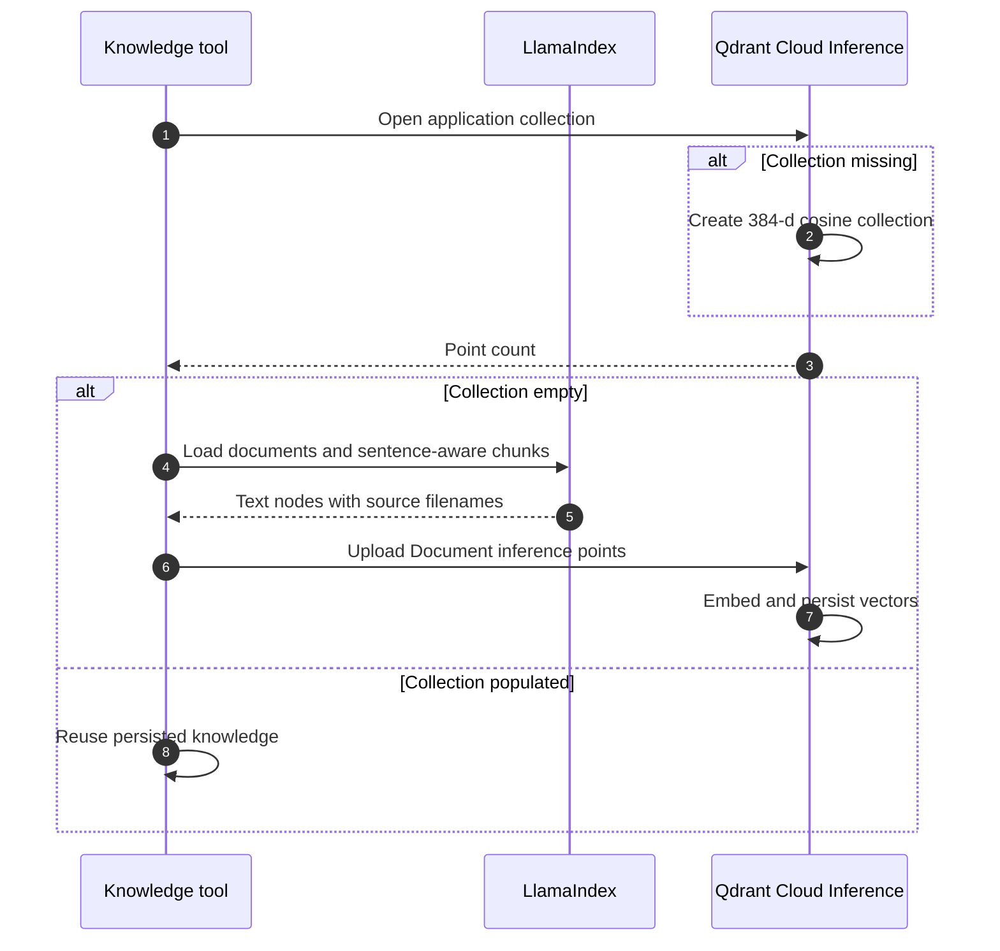
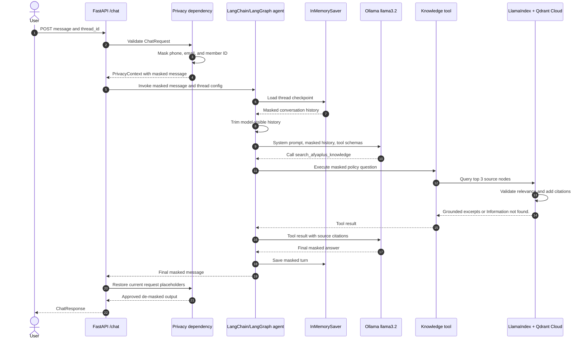
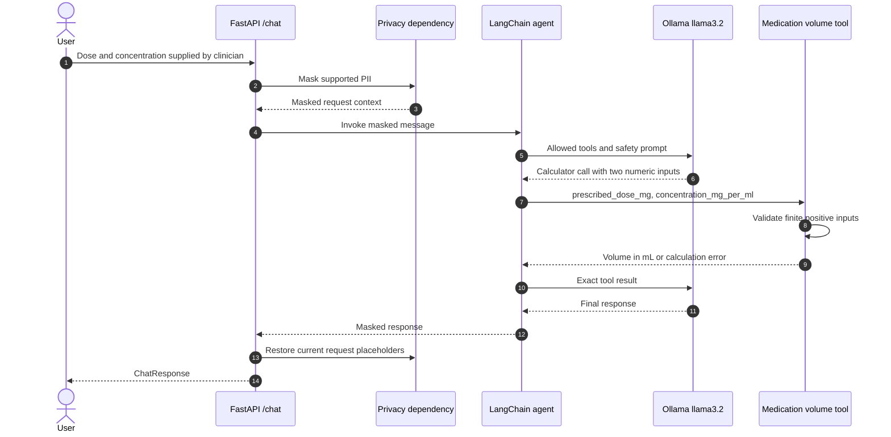
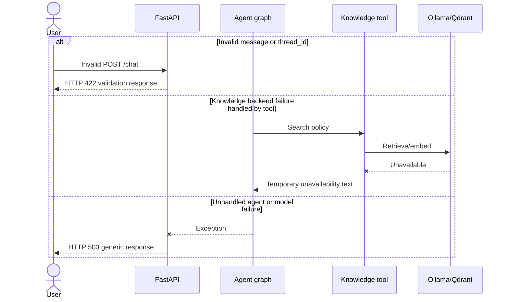

# Request Sequence Diagrams

## Knowledge Collection Initialization

The collection is application-only and distinct from MCP/tooling collections.
Only chunk text and source filename metadata are uploaded.

## Grounded Chat Request

The privacy vault never enters the agent, model, memory, knowledge tool, or
vector store. Only the final API response crosses back through the vault.

## Calculator Tool Request

The calculator performs arithmetic only. It does not choose a dose, validate a
prescription, diagnose a condition, or decide treatment safety.

## Failure Paths

Handled knowledge failures remain inside the tool loop. Unhandled graph or
model errors become a generic 503 response without internal exception details.
